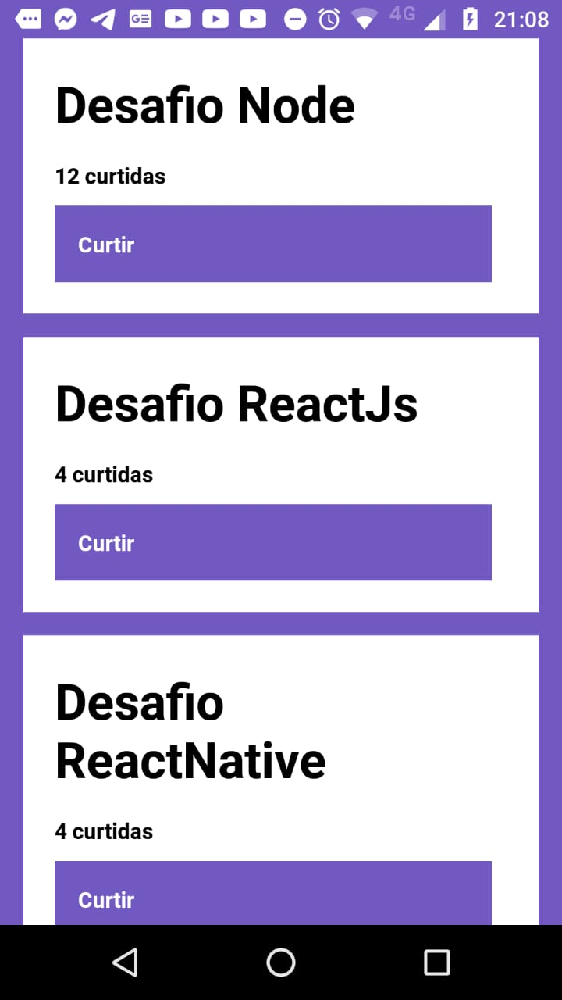

<!-- # bootcamp-gostack-desafios -->

<h3 align="center">  Desafio 4 - Conceitos ReactNative </h3>

### Sobre o desafio

Aplicação para listar, e adicionar likes nos repositórios cadastrados no bachend

### Layout

- Listando repositórios : através da funcão useEffect
- Add like : atravpes da funcão handleLikeRepository

---

> Conceitos do foguete. 
